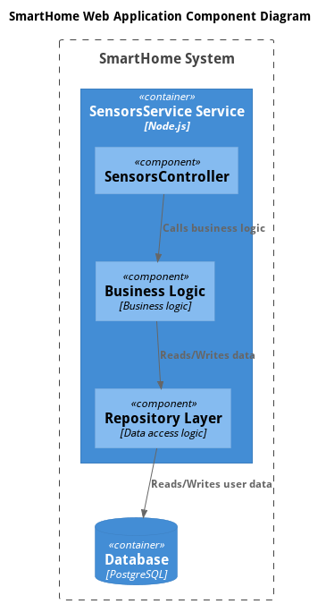
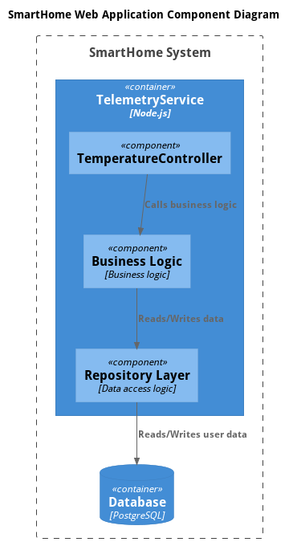
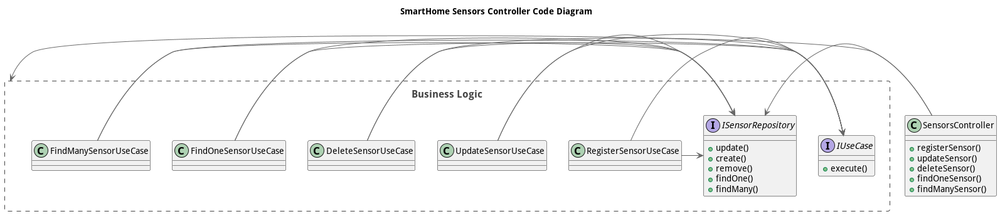
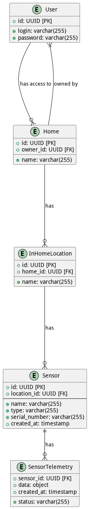

# Задание 1. Анализ и планирование

### 1. Описание функциональности текущего приложения

**Управление отоплением:**

- Пользователи могут устанавливать новые сенсоры в доме при помощи мастера.
- Пользователи могут устанавливать значение температуры на датчиках через приложение.

**Мониторинг температуры:**

- Пользователи могут удалённо проверять список установленных датчиков.
- Пользователи могут удалённо проверять температуру на датчиках.

### 2. Анализ архитектуры текущего приложения

- **Язык программирования**: Go
- **База данных**: PostgreSQL
- **Архитектура**: Монолитная, все компоненты системы (обработка запросов, бизнес-логика, работа с данными) находятся в рамках одного приложения.
- **Взаимодействие**: Синхронное, запросы обрабатываются последовательно.
- **Масштабируемость**: Ограничена, так как монолит сложно масштабировать по частям.
- **Развертывание**: Требует остановки всего приложения.

### 3. Определение доменов и границы контекстов

1. Домен управления пользователями.
	- Регистрация и удаление профилей пользователя.
	- Управление правами пользователей.
2. Домен управления домами.
	- Создание, изменение и удаление дома пользователем.
	- Создание, изменение и удаление помещений в доме.
3. Домен управления датчиками.
	- Добавление и удаление датчиков.
4. Домен управления отоплением.
	- Изменение температуры на датчиках.
	- Получение информации о температуре на датчиках.
5. Домен управления уведомлениями.
	- Изменение температуры на датчиках.
	- Получение информации о температуре на датчиках.
6. Шлюз для устройств.
	- Обновление состояние датчиков через WebSocket.

### **4. Проблемы монолитного решения**

- Объединение доменов в одной кодовой базе (при дальнейшем развитии и росте компании и дроблении команды на отдельные стримы будет затруднительно существовать в одном сервисе; затруднено добавление новых доменов из-за сильной связности доменов).
- Текущее решение затрудняем масштабириванием при росте нагрузки на отдельные части приложения, когда отдельные части системы будут испытывать большую нагрузку.
- Синхронная модель взаимодействия клиент-сервер может не обеспечивать достаточной надёжности, особенно в вопросах управления датчиками.
- Устройства перестают работать без постоянного подключения к серверу.
- В будущем лучше органировать сбор телеметрии через отдельный IoT сервис.
- По мере роста системы может потребоваться разделить базы данных для телеметрии и остальных данных.

### 5. Визуализация контекста системы — диаграмма С4

[Диаграмма контекста](./schemas/context/Context.png)

# Задание 2. Проектирование микросервисной архитектуры

**Диаграмма контейнеров (Containers)**


**Диаграмма компонентов (Components)**




**Диаграмма кода (Code)**



# Задание 3. Разработка ER-диаграммы



# Задание 4. Создание и документирование API

### 1. Тип API

Для подключения микросервисов будет использоваться синхронное взаимодействие, так как оно позволяет быстро перейти к использованию непосредственно микросервисов для обработки части запросов, чтобы проверить работоспособность решения.

### 2. Документация API

- [Документация API микросервиса сенсоров](apps/ms-sensors/ms-sensors.postman_collection.json)
- [Документация API микросервиса телеметрии](apps/ms-telemetry/ms-telemetry.postman_collection.json)

# Задание 5. Работа с docker и docker-compose

// TODO remove?

Перейдите в apps.

Там находится приложение-монолит для работы с датчиками температуры. В README.md описано как запустить решение.

Вам нужно:

1) сделать простое приложение temperature-api на любом удобном для вас языке программирования, которое при запросе /temperature?location= будет отдавать рандомное значение температуры.

Locations - название комнаты, sensorId - идентификатор названия комнаты

```
	// If no location is provided, use a default based on sensor ID
	if location == "" {
		switch sensorID {
		case "1":
			location = "Living Room"
		case "2":
			location = "Bedroom"
		case "3":
			location = "Kitchen"
		default:
			location = "Unknown"
		}
	}

	// If no sensor ID is provided, generate one based on location
	if sensorID == "" {
		switch location {
		case "Living Room":
			sensorID = "1"
		case "Bedroom":
			sensorID = "2"
		case "Kitchen":
			sensorID = "3"
		default:
			sensorID = "0"
		}
	}
```

2) Приложение следует упаковать в Docker и добавить в docker-compose. Порт по умолчанию должен быть 8081

3) Кроме того для smart_home приложения требуется база данных - добавьте в docker-compose файл настройки для запуска postgres с указанием скрипта инициализации ./smart_home/init.sql

Для проверки можно использовать Postman коллекцию smarthome-api.postman_collection.json и вызвать:

- Create Sensor
- Get All Sensors

Должно при каждом вызове отображаться разное значение температуры

Ревьюер будет проверять точно так же.


# **Задание 6. Разработка MVP**

// TODO remove?

Необходимо создать новые микросервисы и обеспечить их интеграции с существующим монолитом для плавного перехода к микросервисной архитектуре. 

### **Что нужно сделать**

1. Создайте новые микросервисы для управления телеметрией и устройствами (с простейшей логикой), которые будут интегрированы с существующим монолитным приложением. Каждый микросервис на своем ООП языке.
2. Обеспечьте взаимодействие между микросервисами и монолитом (при желании с помощью брокера сообщений), чтобы постепенно перенести функциональность из монолита в микросервисы. 

В результате у вас должны быть созданы Dockerfiles и docker-compose для запуска микросервисов. 